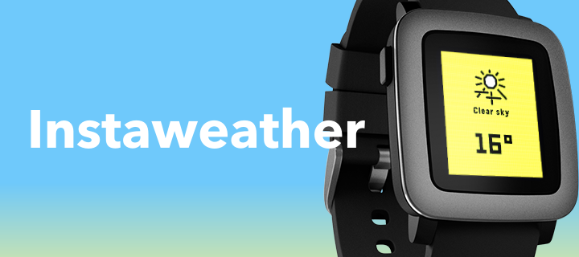
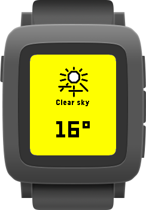
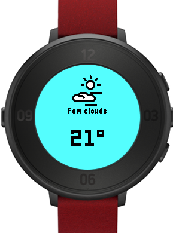
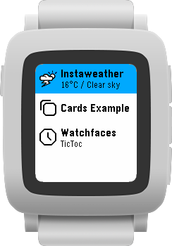

## What is it?

Instaweather is a lightning-fast weather app for the totally-retro Pebble smartwatch. While every other Pebble weather app loads the weather from the internet once you open it, Instaweather fetches and caches weather data in the background every hour so you can view up-to-date weather data instantly!

    

As a bonus, the cached weather data shows up on the app launcher too, so you can check the weather without even opening the app. It's even more instant than instant!

## How do I get it?

If you have a Pebble, you'll soon be able to get this app for free on the Pebble app store! It's currently in the review process, but when it's approved, all Pebble models will be supported. In the meantime (or if you don't have a Pebble), you can still run it in an emulator if you set up the Pebble development environment. Follow the instructions [here](https://github.com/andb3/pebble-setup/blob/main/README.md), clone this repository, and run the command `pebble build && pebble install --emulator basalt`.

## Authors and Acknowledgements

- Built by Alex Kitt
- Fonts and images based on those included in the Pebble SDK
- 📢 Big shoutout to [the Rebble Alliance](https://rebble.io/) for keeping the Pebble SDK and app store running!

